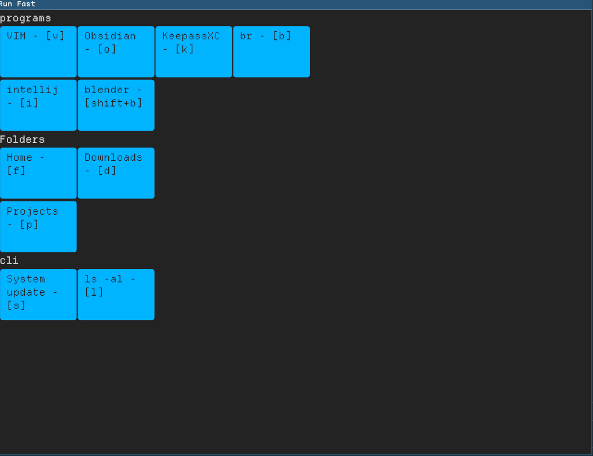

# Going back to iced, after my tauri journey

Tauri is nice, it's really easy to get started, but I feel,
iced deserves some attention, I have used it for a client in a previous project, and it worked pretty well.
It worked on both Linux and Windows, without any extra hassle.
Theming was a bit challenging, but I stole code from AirShipper and made my own.

I switched to Tauri then because widget support is so much better, as it was simply HTML elements.

But now I am working on a small application,
which is unlikely to have any complex user interactions, so, I am giving iced another try.

So, here's the first week of that journey!

## Day One

Getting started was a bit tricky, a lot of changes that have broken my previous app, but the changes seem to be good
changes. But my theme adapted from AirShipper was working anymore. I took a look at the AirShipper repo, and it seems
like it has not updated since. Oh well,

Examples were easy enough to get back to the flow.
Guide is incomplete, have not seen anywhere mentioning which features to get started.
But adding iced crate was enough to get started.

Then took one of the default themes and made small changes, which, unfortunately, is not centralized. Will have to put it in a const and apply it on all widgets, to keep the UI consistent. Maybe a helper function to create widgets using the preferred settings? Will have to come to that later, as these are just visuals. For now, I got a tolerable theme for my new application.

So! Back to the application. What am I building? An application launcher. This is not about discovering applications,
but about running the app that I need right now, fast.
We can do it using Desktop's keyboard shortcut feature, yes.
But I have few issues with this, one if I change the DE to another one,
I will have to map shortcuts for another DE again, moreover, backing up keyboard shortcuts is another pain point.
And every DE have some predefined shortcuts, which might conflict with the one I have.
Now changing the DE shortcut, would be another pain point.
Too much work!
So, this launcher wants to solve that.
I have to allocate only one global keyboard shortcut, that will launch the app.
Once the app is running, it will present the list of keyboard shortcuts that I can use,
which can be all the characters available in keyboard, AND more with modifier key combinations.
Now instead of getting limited to some keys, I have any keys I want to have, except for the Meta key of course :-)

So, with DE level shortcuts, to run terminal I would press `Meta + Enter`,
but with the launcher it will be `Meta+L` (say I've set `Meta+L` as my launcher's shortcut),
once the launcher opens I press `Enter`, and the terminal opens.
It's unlikely I am going to change my terminal shortcut, this is just an example.

But yes, it adds an extra step, instead of direct invocation,
but now I have option to run more things on one additional step.
I think it's a good trade off.
I use similar method in i3 to launch my regular applications.
After a while it becomes a muscle memory.

How to proceed about it? Well, the first thing is how to store the configuration?
As usual, Serde + JSON won this round.
Being so simple and straightforward to get on with.
Now, create the configuration file, and put the configuration they way I want to, which is simply this:

```json

[
  {
    "group": "programs",
    "shortcuts": [
      {
        "name": "VIM",
        "cmd": "wezterm start vim",
        "shortcut": "v",
        "icon": ".default_icon"
      },
      {
        "name": "blender",
        "cmd": "blender",
        "shortcut": "shift+b",
        "icon": ".default_icon"
      }
    ]
  },
  {
    "group": "Folders",
    "shortcuts": [
      {
        "name": "Home",
        "cmd": "nautilus",
        "shortcut": "f",
        "icon": ".default_icon"
      },
      {
        "name": "Downloads",
        "cmd": "nautilus /home/mahmood/Downloads",
        "shortcut": "d",
        "icon": ".default_icon"
      }
    ]
  }
]

```

I have plans with the `groups`, but it's now just there. So is the icon field.

Good thing about Intellij's Rust plugin is, you can copy a valid JSON structure, paste it, and it will generate the structs for you!
This is an amazingly useful feature! Saves so much time. I am sure there are specific tools for this.
Maybe I'll have to take a look someday.

Making the GUI was straightforward. Well, this is a plain application anyway.
Once I have the core features done, I will finetune it.



Yeah, not the best of looks. But it works.

Now, until I add a configuration option in the UI, only way to add shortcuts is to edit the json file.
But changes are not reloaded automatically, will have to restart the program everytime there is a change.
So I want to run a background task that will check the config file and reload if any changes are made.
And iced comes with `time::every` function, that would do the job.
But it's not available with `default` features. At first I was confused, why is it not available?
Actually, this is available only with certain features.
One of them is `smol`, so I add that.

Now in the subscription method, I have two tasks, one is the timer another is key press listener.
using `Subscription::batch` I can return multiple tasks.

So, now I have a task that reloads the configuration file every 2 seconds,
I need to check the file modification date and only update if it's older than the loaded file.
Before I get to that, another important issue I had to solve.

Running the commands have an issue, say you have a configuration like this:

```json
 {
  "name": "System update",
  "cmd": "wezterm start tmux new 'yay -Suy --noconfirm; read'",
  "shortcut": "s",
  "icon": ".default_icon"
}
```

Rust's Command package needs array of strings, normal split would give me this

```json
[
  "wezterm",
  "start",
  "tmux",
  "new",
  "'yay",
  "-Suy",
  "--noconfirm;",
  "read'"
]
```

See the issue?

```
..., "'yay", "-Suy", "--noconfirm;", "read'"]

```

Not good.
Now I started to think along ... regexp?
... Nope.
There are many other complications doing a string processing like this.
Fortunately, a little Google took
me [to this page](https://users.rust-lang.org/t/splitting-string-on-white-space-but-preserving-quoted-substring/73366/2)

A helpful comment explained why regexp or split was not going to work,
and the OP later posted his own solution (Good on him), that worked for me without any changes!
Well, in the end, we both were trying to do the same thing.
Heh.

The solution gave me what I need! And now my program execution was running like a breeze.


