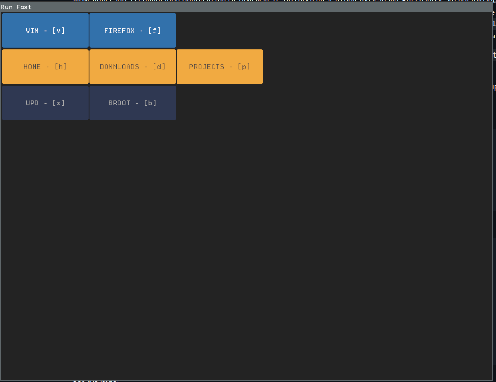

# Random things reminded me of writing this blog

Ah, well, last time was also 24th, but that's two months ago.
It's not like I completely forgot about it,
but no, it's just life, and it's random habit of throwing unexpected things at you at the most random of times.
But that's what life is, right? 

So added a new habit, try to enjoy whatever life throws at you, and mark it down as a job done in your task app.
Well this genius idea was shared in a ADHD productivity post, and I think it's good!

So, where was I?
I was writing a iced-rs application,
and in the middle started working on a Tauri app for a client, which made me realized, tauri 2.0 is pretty nice!

But I also made some nice improvements in the iced-rs app I was working on.

Hm, I think I should be opening up the repo, and share so that people can roast me. 
I will write in details of the app in the next phase, but here's how it stands right now!





So no group names, but colorful buttons! Yeah

Here's the config

```json
{
  "group_font_size": 20.0,
  "label_font_size": 16.0,
  "button_width": 200,
  "button_height": 80,
  "buttons_par_row": 5,
  "shortcuts": [
    {
      "group": "programs",
      "background": "#3271ab",
      "text_color": "#fff",
      "shortcuts": [
        {
          "name": "VIM",
          "cmd": "$TERMINAL start vim",
          "shortcut": "v"
        }, {
          "name": "Firefox",
          "cmd": "firefox-nightly",
          "shortcut": "f"
        }
      ]
    },
    {
      "group": "folders",
      "background": "#f1aa41",
      "text_color": "#444",
      "shortcuts": [
        {
          "name": "Home",
          "cmd": "xdg-open ~",
          "shortcut": "h"
        },
        {
          "name": "Downloads",
          "cmd": "xdg-open ~/Downloads",
          "shortcut": "d"
        },
        {
          "name": "Projects",
          "cmd": "xdg-open ~/Projects",
          "shortcut": "p"
        }
      ]
    },
    {
      "group": "cli",
      "background": "#2f3852",
      "text_color": "#AAA",
      "shortcuts": [
        {
          "name": "Upd",
          "cmd": "$TERMINAL start tmux new 'yay -Suy --noconfirm; read'",
          "shortcut": "s"
        }, {
          "name": "broot",
          "cmd": "$TERMINAL start broot",
          "shortcut": "b"
        }
      ]
    }
  ]
}
```

Lot of interesting things here! 
1. Groups have different colors. 
2. No group names
3. Setting font size, button size, and buttons per row can be set
4. And most interesting is support for shell magic variables, like (`$HOME`, `$TERMINAL`, `~`, etc.)!

So now the program will launch using the preferred terminal, use the default file manager to open the folders, etc

Awesome!

And no more checking configuration files every 2 seconds, because the program exits after launching.
It is now a run, and bye program, instead of staying in memory doing nothing. 

Forgot what else I want to do in this, but I will get back to it,
after I have made progress on my other pet project.